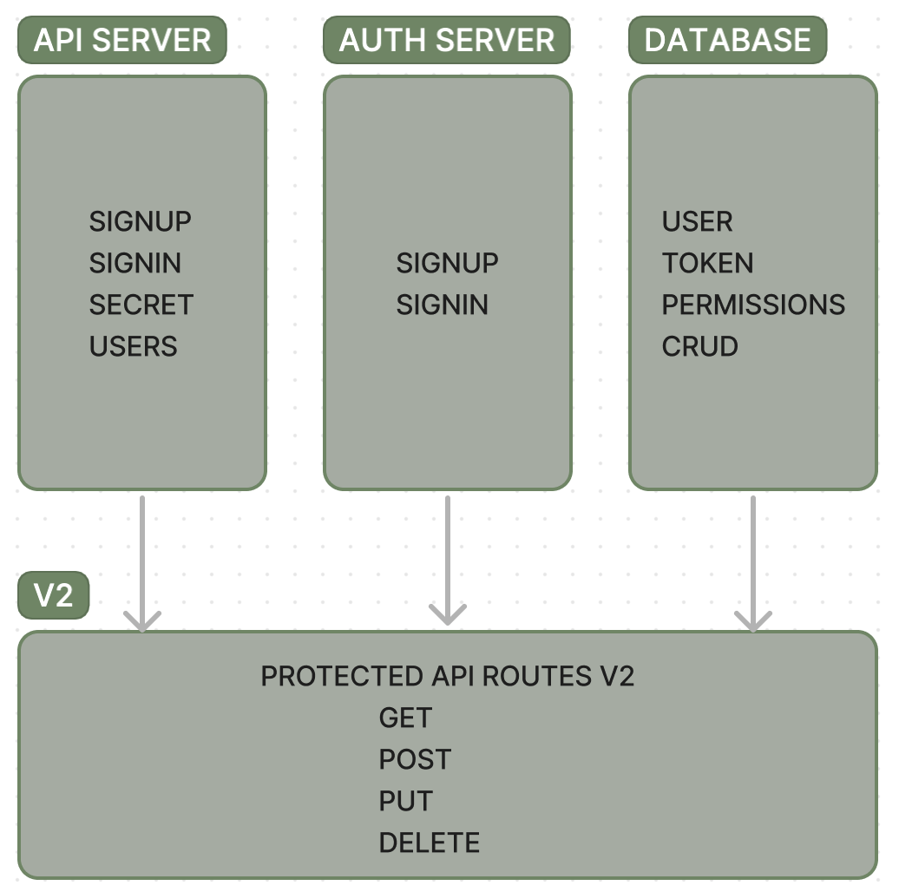

# auth-api

**Author**: Wajiha Khan

**Version**: 1.0.0

**Overview**:

The integrated system comprises an API server and an authentication server, facilitating user management and access control. Regular users can read data, while writers can read and create content. Editors possess additional capabilities to update existing data, and administrators have full control, including deletion privileges. These permissions are enforced through Bearer Authentication and Access Control Lists (ACLs). The system's new version introduces protected API routes (V2) requiring specific capabilities for access, ensuring secure and controlled interactions with the server.
